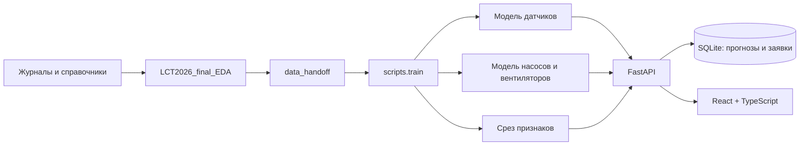

# Контур: устройство проекта

## Границы модулей

* `backend/ml/contracts.py` — направления, разрешённые признаки и защита от утечки будущего.
* `backend/ml/training.py` — обучение, временная проверка, выбор модели/порога, метрики и joblib.
* `backend/ml/demo.py` — самостоятельный детерминированный генератор синтетических данных.
* `scripts/train.py` — адаптер **точного формата** `data_handoff` из исходного ноутбука.
* `backend/service.py` — загрузка артефактов, пакетный скоринг, контекст прогноза.
* `backend/store.py` — SQLite с WAL, транзакциями и ограничением уникальности открытой заявки.
* `backend/main.py` — REST API и раздача собранного фронтенда.
* `frontend/src/api.ts` — единственное место HTTP-клиента и типов ответа.
* `frontend/src/components` — карта-схема, таблица и модальная карточка прогноза.

Один процесс Uvicorn и одна SQLite достаточны для локального прототипа. Обучение — отдельная CLI-команда. При старте API модели загружаются один раз через lifespan. `/api/predictions/run` пересчитывает **тот же локальный срез**, не получает новые журналы и не переобучает модель. Для новой выгрузки повторите подготовку и обучение, затем перезапустите API.

## Артефакт модели

`runtime/<mode>/models/<direction>.joblib` содержит `{model, metadata}`. `model` реализует `predict_proba(DataFrame)`. `metadata` содержит упорядоченные `features`, `target`, `threshold`, `version`, `provenance`, временные границы и метрики. JSON рядом позволяет инспектировать контракт без десериализации.

Пути к артефактам фиксированы конфигурацией. API не принимает загружаемые pickle/joblib. Загружать можно только доверенные локально обученные артефакты: joblib выполняет Python-десериализацию.

Для замены алгоритма добавьте кандидата в `train_model` или сохраните артефакт с таким же интерфейсом и метаданными. Добавленные признаки должны присутствовать и в обучающих файлах, и в `scoring.parquet`. После замены перезапустите API. Старые прогнозы и связанные заявки остаются в SQLite; активная выдача показывает текущие версии моделей.

## Персистентность и ограничения

Docker монтирует `./runtime`. Режимы хранятся в разных подпапках `demo` и `real`: синтетические данные не подмешиваются к реальным. В режиме `real` отсутствие артефактов останавливает запуск с объяснением. База не перезаписывается при обучении.

Ключ прогноза зависит от направления, канала, момента прогноза и версии модели. Повторный расчёт не создаёт дубликаты. На один прогноз разрешена одна открытая заявка; после закрытия можно создать новую. Автогенерация идемпотентна относительно открытых заявок того же прогноза, но разные ежедневные прогнозы могут создать несколько заявок по одному каналу. Политика объединения таких заявок — следующий этап.

Сервис привязан к `127.0.0.1`. Аутентификация и роли пока отсутствуют; подпись «Диспетчер ОДС» обозначает рабочее место, а не вход пользователя. Для многопользовательского развёртывания нужны авторизация, аудит действий, PostgreSQL и фоновый worker. Docker и локальный процесс не должны одновременно писать в один каталог runtime.

## Фронтенд для дизайнера

Тема и адаптивные правила находятся в `frontend/src/styles.css`. Основные переменные: `--forest`, `--mint`, `--line`, `--muted`, `--orange`, `--radius`. Компоненты не обучают модели и не содержат расчётных бизнес-правил. Навигация локальная, без внешнего сервиса и без CDN. Шрифты системные, иконки входят в bundle. Данные карты демонстрационные и подписаны; реальные объекты без координат отображаются реестром, координаты не выдумываются.

Для будущего GIS достаточно заменить `NetworkMap.tsx`, сохранив вход `Collector[]` и callback `onSelect(objectId)`. Для полноценного интерфейса можно разбить разделы `App.tsx` на страницы и добавить роутер, не меняя API.
